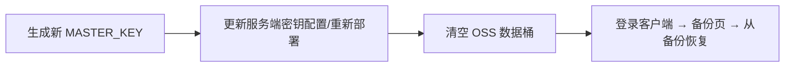

# 服务端主密钥（MASTER_KEY）丢失影响指南

> 面向运维/管理员的说明。技术原理见 [dev-guide/security.md](../dev-guide/security.md)。

## 1. 什么是 MASTER_KEY

MASTER_KEY 是量潮机密云**服务端的主密钥**（base64 32 字节，AES-256-GCM）：

```
客户端（登录后）──明文──▶ 服务端 ──MASTER_KEY 加密──▶ OSS（密文落盘）
```

- 它加密**所有条目**的 secret 字段（name 等元数据为明文，供列表展示）
- 它是**运维资产**：由运维生成、注入服务端环境变量（GitHub org secret MASTER_KEY），与用户账号无关
- 用户登录（qtcloud-auth 账号密码）**不依赖**此密钥

## 2. 丢失后有什么影响

| 影响面 | 说明 |
|--------|------|
| **全部条目的密文内容永久不可读** | AES-256-GCM 没有后门——没有密钥，256 位密钥暴力破解在计算上不可行 |
| 条目列表（name）仍可见 | name 明文存储，列表不受影响 |
| 账号与登录不受影响 | 认证走 qtcloud-auth，独立于本密钥 |
| OSS 里的密文文件还在 | 数据没有"消失"，但失去了读取能力（除非找回密钥） |
| **有明文备份 → 可完整恢复** | 备份页导出的 NDJSON 是明文副本，不依赖此密钥 |

一句话：**丢密钥 = 丢全部条目的读取能力；备份（明文导出）是唯一恢复通道。**

## 3. 为什么不能找回

加密设计如此：只有持有密钥才能解密。OSS 的 SSE-OSS 加密是**第二层**（OSS 托管密钥），
但应用层密文仍由 MASTER_KEY 加密——即使 OSS 层可读，应用层密文依然无法解密。

## 4. 丢失后的处置流程

### 方案 A：有明文备份（推荐长期保持）



1. 生成新密钥：`openssl rand -base64 32`，更新 GitHub org secret `MASTER_KEY`（并保存副本）
2. 重新部署 provider（新密钥生效，旧密文无法解密，需清空）
3. 清空 OSS 数据桶（旧密文已无意义）：`aliyun oss rm oss://qtcloud-secret-data/secrets/ -r -f`
4. 登录客户端 → 备份页 → 粘贴备份 NDJSON → 从备份恢复（新密钥加密落盘）

### 方案 B：无备份

数据不可恢复。只能清空数据从零开始——再次强调**定期导出明文备份**的重要性。

## 5. 预防措施（防丢失）

| 措施 | 说明 |
|------|------|
| **多副本保管** | 密钥存入密码管理器 + 离线加密介质，至少两处 |
| **与 JWT_PRIVATE_KEY 分开保管** | 避免一处泄露同时失守认证与加密 |
| **定期导出明文备份** | 备份页导出 NDJSON 并离线保存——密钥丢失时唯一恢复通道 |
| **密钥轮换流程** | 换密钥前先导出备份：导出 → 换 MASTER_KEY → 清空数据 → 恢复备份 |

## 6. 与旧方案（零知识）的对比

| | 旧方案（零知识） | 当前方案（服务端加密） |
|---|---|---|
| 密钥持有者 | 每个用户（主密码+恢复码） | 运维（MASTER_KEY） |
| 丢失影响 | 该用户数据不可恢复 | 全部条目不可读 |
| 恢复通道 | 恢复码（用户保管） | 明文备份（运维导出） |
| 用户负担 | 高（双因子派生、不能丢） | 无（登录即用） |

两种方案丢失密钥都意味着数据不可读；当前方案的恢复路径更明确（备份恢复），
且把负担从"每个用户"集中到"运维"（可制度化备份）。
